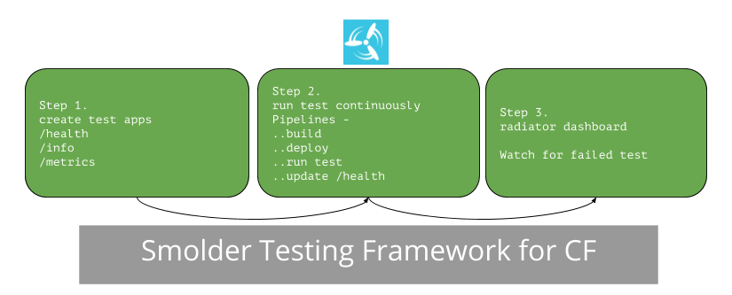
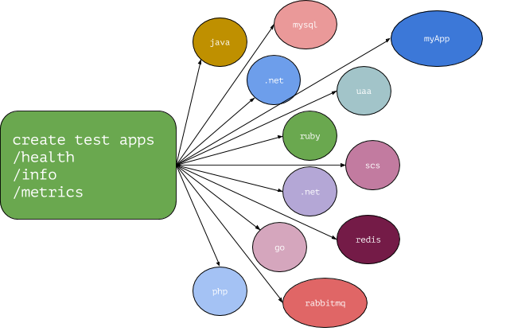

## Smolder Testing Framework for Cloud Foundry

The *Smolder* testing framework is for application developers who are pushing code to the platform and cloud foundry operators who are constantly updating the platform.

The application developers would like to see if their code is not broken - either through unit/integration/load testing.
The cloud foundry operators would like to see that the updates to the platform in not breaking any application development focused tests -- e.g. buildpack test, uaa test, connectivity to services tests.

The assumption is that each test in the testing harness has few rest endpoints /health, /metrics , /info which will provide the details on if the test is working or if the test is broken. The test harness draws inspiration from
[Spring Actuator Project]( (http://docs.spring.io/spring-boot/docs/current/reference/html/production-ready-endpoints.html)


### Big Picture

The testing framework is based on simple principles. Apps on *cf* have to be tested continuously and they have consistent endpoints to check if the test passed or failed.  


### Components of the Test Framework
--
There are three main components of the Test Framework. 

1. The test applications with the ci pipelines are in the [cf-test-harness](https://github.com/rjain-pivotal/cf-test-harness) git repo.
2. [Concourse] (http://concourse.ci) is used for build, deploy and running the test applications to cloud foundry. 
3. And finally the *radiator* dashboard is a dashboard which looks at all the apps deployed in the  org/space of cloud foundry which the user is authorized to, and checks the /health endpoint.


### CF Test Harness

[Git Repo](https://github.com/rjain-pivotal/cf-test-harness)



This test harness has a series of apps which tests buildpacks, cf components and services. Each of the test has a /health, /info and /metrics endpoint. The test case for unit, integration and load test would update the /health, /metrics endpoint after the test is executed.

For execution of the test, the */ci* folder has a Concourse pipeline. The pipelines files in pipeline.yml, and the deploy test script does the deployment of all the pipelines to a Concourse server.

Application developers can clone and make similar test for their own applications and deploy them in their own org and space.

### Concourse

The Concourse server doesn't need to be on CF platform. You can run your own Concourse server using [Docker](https://concourse.ci/docker-repository.html) or you can use the Concourse Tile on the CF Platform to create your own [Concourse Server Instance](https://network.pivotal.io/products/p-concourse/)

When you use deploy the pipelines to the concourse server, you can specific the CF target API, Org, Space to deploy the apps.

### Radiator Dashboard

[Git Repo](https://github.com/rjain-pivotal/radiator-dash)

The Radiator Dashboard provides the /health, /metrics data for all the apps which the user is authorised to query on the Cloud foundry platform. It uses UAA to connect and get the authorization token and then query all the orgs and spaces which the user is authorized to query.

This is a one time deployment per test framework deployment.


## Getting Started

Here is an example of the test harness written for the Platform Operators, which will use for the getting Started Guide. Application developers can follow the same steps, except their tests might change and they can deploy the Radiator Dashboard and Concourse in their own org/spaces.


#### Step 1: Get the Test Harness

```
   git clone https://github.com/rjain-pivotal/cf-test-harness.git
   cd cf-test-harness
```
#### Step 2: Connect to your Concourse Server

Assuming that you have a concourse server, e.g concourse-s0.rjainpcf.com and a team with the name smolder-test
(Refer here on how to create teams in Concourse : https://concourse.ci/fly-set-team.html)

```
   fly -t aws login -c https://concourse-c0.gcp.rjainpcf.com -k --team-name smolder-test
```

#### Step 3: Deploy all the pipelines

Once you are connected to the Concourse server, you can deploy all the pipelines to the server.
Edit the config file in the ci/config.example folder and rename it as ci/config.yml
The *cf-app-suffix* and *cf-app-domain*  are unique suffix and domain names for the apps so that they don't clash with other apps with the same name and domain name deployed in cloud foundry installation.

```
   github-uri: https://github.com/rjain-pivotal/pcf-test-harness.git
   github-branch: master
   cf-api:
   cf-username:
   cf-password:
   cf-org:
   cf-space:
   cf-app-suffix:
   cf-app-domain:

```

Next, execute the command

```
   deploy-pipelines.sh ci/config.yml
```

This will go recursively in every test directory and deploy the ci/pipeline.yml with the configuration from the ci/config.yml


#### Step 4: Open up the Concourse Dashboard

You should see all you concourse pipelines ready to execute in your concourse dashboard e.g. below.

There are three triggers for your concourse pipelines

1. If there is a code change in the test harness, the git webhook will trigger the pipeline
2. Every hour the complete pipeline of "build, deploy, test, report" will be executed.
3. Every five minutes, only the "test, report" pipeline will be executed.

You can control the triggers by changing the pipeline.yml file.

The basic pipeline is just executing a *unit test* which is very specific to the application. For example the java *unit test* will just execute the deployment of simple program and executing a "/" endpoint which updates the "/health" endpoint

You can write more advanced test, which could execute a piece of code every time the test is run. You can also add additional jobs in the pipeline to execute *integration* and *load* tests. The nodejs pipeline does that.

#### Step 5: Deploy the Radiator Dashboard

The radiator dashboard is a Nodejs/ReactJS app.

```
  cd ..
  git clone https://github.com/rjain-pivotal/radiator-dash.git
  cd raditor-dash
  cf login -a https://cf.rjainpcf.pivotal.io --skip-ssl-validation
  cf push
```

#### Step 6: Open the Radiator Dashboard

Navigate to the Radiator Dashboard URI from the above step, login using your UAA userid/password and you should be able to see all the apps that we are testing.

If you click on the Health Details, you will see all the Health and Metrics details of the app.
